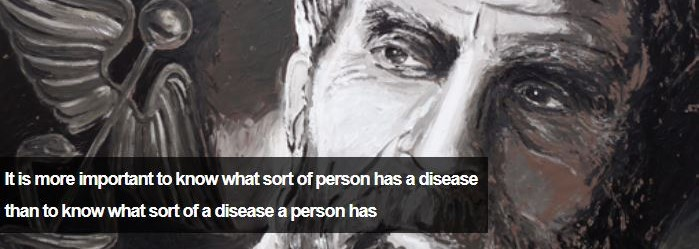
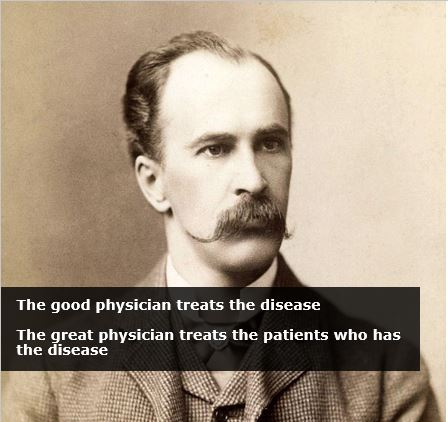

```{r setup, include=FALSE}
knitr::opts_chunk$set(echo = TRUE)
```

## Seminar : AI/ML on Healthcare services 

| | |                                                      
| --------- | -------------------------------------------------------------------- |
| __Date__  |: 2018-10-26 19:00-21:00                                               |
| __Location__  |: 4th floor, WeWork Seoulsquare, <br /> &nbsp; 416 Hangang-Daero Jung-gu Seoul 04637 |
| __Audience__  |: anyone who interests ML on healthcares                               |


## Session info 

* **Part 1 :** [introduction](#Session1introduction)

* **Part 2 :** [AI/ML_on_Genomics](#Session2)

## Today's speaker
<hr>

<table>
<tr cellspacing=10px>
  <td cellspacing=5px width=20%> </td>
  <td> <b>Byungju Kim </b>   
       <li> `Not an AI/ML expert`</li><li> but `Bioscience/Genomics researcher` using AI/ML.</li><li> Ph.D. @ Yonsei</li><li> Researcher @ UC berkeley</li>
       </td >
</tr>
</table>

<hr>

<table>
<tr>
  <td cellspacing=5px width=50%>  &nbsp; </td>
  <td><b> EDGC</b> (E-one diagnostics Genome Center)</td>
</tr>
</table>

<hr>

<table>
<tr>
  <td cellspacing=5px width=50%>  &nbsp; </td>
  <td><b> Incheon University</b></td>
</tr>
</table>
<hr>

# Session 1 : introduction | Precision/Personalized medicine and human genome {.build}


## Precision/Personalized medicine {.build}

* This is **not a new concept**



* Identify the best approaches will be effective for which patients based on genetic, environmental, and lifestyle factors

## Precision/Personalized medicine 


many ... many ... too ... many missing values 


## Triad of the disease

**Host factors**

- `inherited genome`

**Environmental facotrs**

- Virulence factors
-

**Life-style factors**

-
- 

## my point of view : Meaning of the First Human Genome sequenced, 


* it's just an announcement of new start.

* "getting information" -> "Understanding the information" -> 


## History of Human genome

* Watson & Crick

* Sequencing

ref :

## current knowledge about human genome

* Hapmap & g1k population.

```{r}


```

* 80 % variations are single nucleotide variation.
* 

## Current knowledge about human genome and Traits.

* GWAS catalog ????


## Missing Heritability

$$ Missig h^2 = \hat{h}^{2}_{pedigree} - \hat{h}^{2}_{stat}$$

## current project

- Colon cancer susceptibility 

## Current limitation :

- role of `common` variation in ~~~.

## Genomic signals we have.

- population signal *most largest signal.

**Principle Component analysis**

- Clustering of ~~

**t-SNE clustering of the population**

**k-Nearleast neighbor method on Chromosome 22.**
- 97% accurately predict superpopulation

## Common traits

- Height

- Body mass index (Weight)

## EDGC Service 

- NICE

* Predict fetal genomic defects from fetal fraction.

# Session 1 : ML and human genomics

## What's the Machine Learning ?

**Arthur Samuel (1901-1990)**

>> Giva a computer the ability to learn without beign explicitly programmed.

**Tom Mitchel (1951 - present )**

>>  A computer program is said to learn from experience E with respect to some task T and some performance measure P, if its performance on T, as measured by P, improves with experience E. 


* 


## Kind of ML

- Supervised Learning

- unsupervised Learning

## k-Nearleast Neighbor | example

## Support Vector Machine | example

## Decision Tree | example

## Random-Forest | example

## Ensemble | example

## Neural-Network | example

**colon cancer**


- 97% accurately prediction of ~~~.

-

## 

## Genomic science as DATA science/Big Data

- The Era of Big data.


## DATA Level/Layer

* Central Dogma and

  DNA -> mRNA -> protein -> function
 
  -our genomic data has 3 layers.

*


* Gene-set enrichment assay.


# Session 2 : my Experiences


**Disease Prediction**

* prediction of cancer, ND, SLE, Asthma susceptibility

* Korean Colon Cancer susceptibility and diagnosis**

**Pharmacogenomics | prediction of drug adverse effect**

* 


## Cancer susceptibility Prediction

- TCGA samples

- published this year (pnas)

- We could predict ~~~,~~~,~~~.

## Drug Adverse Effects (ongoing)

- **HIV** drug : Nevirapine (commercial name : Viramune)
- supportvector machine on SNPs.
- 85% of adverse effect generated by ~~~ is detected by the algorithm.

## Systemic Lupus Erithro~~~.


## Phenotyping,

* current ~~ is based on the ~~~, not molecular level.

(e.g)

## Term Standardization

**gdist**

## Problems

- Phenotyping

- Sample Size Matters

- 


# References

*

*

*

*

*

*